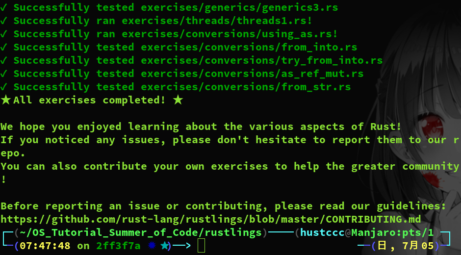
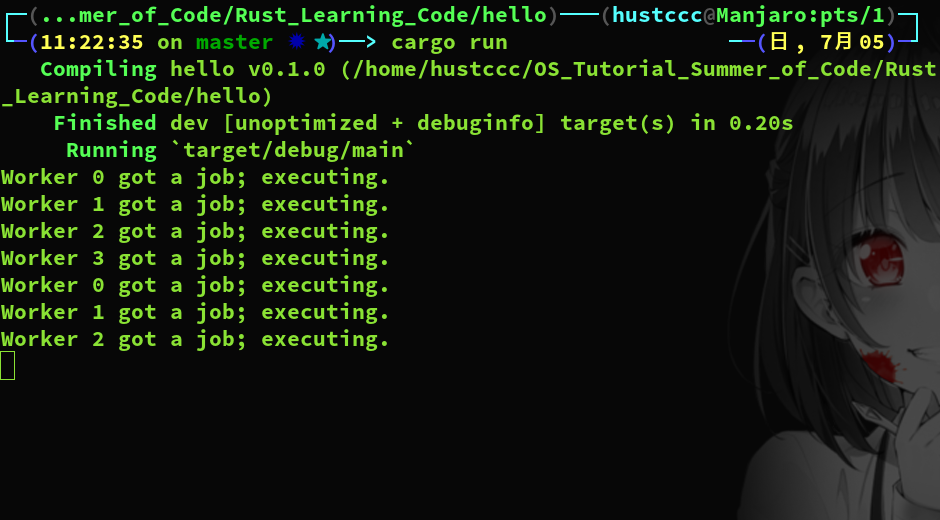

# DailySchedule

## **TOC**

 

*六月*                

| Mon                  | Tues                   | Wed                  | Thur                 | Fri                  | Sat                   | Sun                  |
| -------------------- | ---------------------- | -------------------- | -------------------- | -------------------- | --------------------- | -------------------- |
| 1   | 2   | 3  | 4   | 5   | 6  | 7  |
| 8  | 9   | 10 | 11 | 12  | 13 | 14 |
| 15  | 16 | 17 | 18 | 19  | 20  | 21 |
| 22  | 23 | 24 | 25  | 26  | 27  | 28  |
| 29  | 30   ([D0](#0))   |                      |                      |                      |                       |                      |

*七月*

| Mon                  | Tues                 | Wed                  | Thur                 | Fri                  | Sat                  | Sun                  |
|----------------------|----------------------|----------------------|----------------------|----------------------|----------------------|----------------------|
|                      |                      | 1   ([D1](#1))   | 2   ([D2](#2))                  | 3   ([D3](#3))                    | 4   ([D4](#4))                    | 5   ([D5](#5))                    |
| 6   ([D6](#6))                   | 7   ([D7](#7))                   | 8   ([D8](#8))                    | 9   ([D9](#9))| 10   ([D10](#10))  | 11   ([D11](#11)) | 12   ([D12](#12)) |
| 13   ([D13](#13)) | 14   ([D14](#14)) | 15   ([D15](#15)) | 16    ([D16](#16))| 17   ([D17](#17)) | 18   ([D18](#18)) | 19   ([D19](#19)) |
| 20  | 21  | 22  | 23  | 24  | 25  | 26  |
| 27 | 28 | 29  | 30 |                      |                      |                      |

## OLD TOC Day 0~60

* [Day 0](#0)  
* [Day   1    (2020-07-01)](#Day001)   
* [Day   2    (2020-07-02)](#Day002)   
* [Day   3    (2020-07-03)](#Day003)  
* [Day   4    (2020-07-04)](#Day004)  
* [Day   5    (2020-07-05)](#Day005)  
* [Day   6    (2020-07-06)](#Day006)  
* [Day   7    (2020-07-07)](#Day007)  
* [Day   8    (2020-07-08)](#Day008)  
* [Day   9    (2020-07-09)](#Day009)  
* [Day  10    (2020-07-10)](#Day010)  
* [Day  11    (2020-04-20)](#Day011)  
* [Day  12    (2020-04-21)](#Day012)  
* [Day  13    (2020-04-22)](#Day013)  
* [Day  14    (2020-04-23)](#Day014)   
* [Day  15    (2020-04-24)](#Day015)  
* [Day  16    (2020-04-25)](#Day016)  
* [Day  17    (2020-04-26)](#Day017)  
* [Day  18    (2020-04-27)](#Day018)  
* [Day  19    (2020-04-28)](#Day019)  
* [Day  20    (2020-04-29)](#Day020)  
* [Day  21    (2020-04-30)](#Day021)  
* [Day  22    (2020-05-01)](#Day022)  
* [Day  23    (2020-05-02)](#Day023)  
* [Day  24    (2020-05-03)](#Day024)  
* [Day  25    (2020-05-04)](#Day025)
* [Day  26    (2020-05-05)](#Day026)
* [Day  27    (2020-05-06)](#Day027)  
* [Day  28    (2020-05-07)](#Day028)  
* [Day  29    (2020-05-08)](#Day029)  
* [Day  30    (2020-05-09)](#Day030)  
* [Day  31    (2020-05-10)](#Day031) 
* [Day  32    (2020-05-11)](#Day032) 
* [Day  33    (2020-05-12)](#Day033) 
* [Day  34    (2020-05-13)](#Day034) 
* [Day  35    (2020-05-14)](#Day035) 
* [Day  36    (2020-05-15)](#Day036) 
* [Day  37    (2020-05-16)](#Day037)  
* [Day  38    (2020-05-17)](#Day038)  
* [Day  39    (2020-05-18)](#Day039)  
* [Day  40    (2020-05-19)](#Day040)⭐  
* [Day  41    (2020-05-20)](#Day041)  
* [Day  42    (2020-05-21)](#Day042)  
* [Day  43    (2020-05-22)](#Day043)  
* [Day  44    (2020-05-23)](#Day044)  
* [Day  45    (2020-05-24)](#Day045)  
* [Day  46    (2020-05-25)](#Day046)  
* [Day  47    (2020-05-26)](#Day047)  
* [Day  48    (2020-05-27)](#Day048)  
* [Day  49    (2020-05-28)](#Day049)  
* [Day  50    (2020-05-29)](#Day050)  
* [Day  51    (2020-05-30)](#Day051)  
* [Day  52    (2020-05-31)](#Day052)  
* [Day  53    (2020-06-01)](#Day053)  
* [Day  54    (2020-06-02)](#Day054)
* [Day  55    (2020-06-03)](#Day055)
* [Day  56    (2020-06-04)](#Day056)
* [Day  57    (2020-06-05)](#Day057)
* [Day  58    (2020-06-06)](#Day058)⭐
* [Day  59    (2020-06-07)](#Day059)
* [Day  60    (2020-06-08)](#Day060)

## Day 0
### 预期计划
+ 配置好rust语言在Linux上的开发环境，包括编译，运行和代码管理
+ 给rustup换成国内源
+ 初步了解rust语法

### 事件1： 决定参加2020年OS Tutorial Summer of Code活动
在github上看到活动信息，稍微思考后决定报名参加。我本来就喜欢Linux，对操作系统很感兴趣，一直想要自己写一个操作系统。遇到这次机会肯定不能放过。立马写好简历发给清华大学的陈渝老师，寄出投名状。  

### 事件2：阅读活动相关内容，要求
投递简历后，阅读github上活动主页的信息，觉得任务十分艰巨。我们学校操作系统原理，计算机组成原理，编译原理这三门课全都在大三上才开，而我刚刚大二学年结束。Rust语言，RISC-V体系结构也没接触过。时间紧迫，马上开始学习。  

### 事件3：着手开始学习Rust语言
查阅多方资料后，开始阅读《The Rust Programming Language》进行Rust语言的学习。  
[The Rust Programming Language](https://doc.rust-lang.org/book/)  
上面的链接很清楚完整地说明了rustup在Linux系统下的安装，下面这个链接说明了如何更rustup改为国内镜像源：  
[rust国内源](https://www.jianshu.com/p/cf1b534dbb16)  
按照文档《The Rust Programming Language》基于rust实现了一个猜数字小游戏，并通过这个简单的例子对rust语言有了初步的了解。  

### 问题
+ rustup在Linux系统上如何安装
+ 如何使用cargo管理rust项目和代码
+ 如何将rustup换成国内源

## Day 1 （2020-07-01）

### 预期计划
+ 完成《The Rust Programming Language》中前十个章节的学习
+ 动手实现文档中的实例代码并理解

### 事件1：继续学习rust语言
阅读文档[The Rust Programming Language](https://doc.rust-lang.org/book/) ，完成了以下模块的学习：  
+ rust中的常见编程概念
+ 认识rust中的所有权
+ 使用rust结构体
+ 枚举与模式匹配
+ 使用包，Crate和模块管理项目
+ rust中的常见集合vector，字符串和哈希map
+ 错误处理
+ 泛型，trait和生命周期

并动手实现了上面某些模块的示例代码。  

### 问题
+ 对于以上模块的学习，有些是一知半解，一些细节比较难掌握
+ rust语言和我之前学的C或C++之间有不少不同点
+ 泛型和trait这部分的内容难以理解

## Day 2 （2020-07-02）
### 预期计划
+ 完成《The Rust Programming Language》中第11,12章节的学习
+ 学习《Rust编程之道》第2,3,4,5章，重点巩固一下之前半知半解的内容
+ 着手开始做一些Rust编程小练习 

### 事件1：学习如何编写Rust自动化测试
Rust 是一个相当注重正确性的编程语言，不过正确性是一个难以证明的复杂主题。Rust 的类型系统在此问题上下了很大的功夫，不过它不可能捕获所有种类的错误。为此，Rust 也在语言本身包含了编写软件测试的支持。  
Rust为测试提供了许多注解和宏，这让我们可以很方便直观地进行软件功能测试以及Debug。  
首先学习了如何编写测试，然后动手实现一些测试代码，并理解测试的组织结构。  

### 事件2：完成一个I/O项目：构建一个命令行程序
基于Rust语言实现Linux系统下的经典命令行工具grep。  
grep最简单的使用场景是在特定文件中搜索指定字符串。为此，grep获取一个文件名和一个字符串作为参数，接着读取文件并找到其中包含字符串参数的行，然后打印出这些行。  
学习如何让命令行工具利用很多命令行工具中用到的终端功能。读取环境变量来使得用户可以配置工具的行为。打印到标准错误控制流（stderr） 而不是标准输出（stdout），这样用户可以选择将成功输出重定向到文件中的同时仍然在屏幕上显示错误信息。  
[minigrep](https://github.com/SKTT1Ryze/OS_Tutorial_Summer_of_Code/tree/master/Rust_Learning_Code/minigrep/src)

### 事件3：完成《Rust编程之道》第十章的完整实例代码，掌握Cargo和模块系统
编写一个命令行工具，可以接收一个CSV文件，并且可以指定固定的值来覆盖指定列的所有数据，然后将结果输出到新的CSV文件中。  
通过编写这个实例代码，从零开始实现一个完整功能包，掌握如何使用Cargo管理包和模块系统。  
同时也是对前面的理论学习的温故知新。  
[csv_challenge](https://github.com/SKTT1Ryze/OS_Tutorial_Summer_of_Code/tree/master/Rust_Learning_Code/csv_challenge/src)

### 事件4：学习迭代器与闭包
Rust 的 闭包（closures）是可以保存进变量或作为参数传递给其他函数的匿名函数。可以在一个地方创建闭包，然后在不同的上下文中执行闭包运算。不同于函数，闭包允许捕获调用者作用域中的值。  
迭代器模式允许你对一个项的序列进行某些处理。迭代器（iterator）负责遍历序列中的每一项和决定序列何时结束的逻辑。当使用迭代器时，我们无需重新实现这些逻辑。  
闭包和迭代器概念在Rust语言中使用特别多，需要完全掌握。  

### 事件5：阅读《Rust编程之道》第2,3,4,5章
浏览《Rust编程之道》第2,3,4,5章，回顾之前的知识，并对梳理一遍之前半知半解的内容。  
重点理解泛型，trait，生命周期参数。  

### 事件6：着手开始做一些Rust小练习题
练习题链接：[exercises](https://github.com/rust-lang/rustlings)  
完成了以下练习题：  
+ variables
+ primitive_types
+ functions
+ if
+ struct

## Day 3 （2020-07-03）
### 预期计划
+ 继续完成一些Rust练习题
+ 学习《The Rust Programming Language》14，15章的内容
+ 查阅一些资料，初步了解一下RISC-V系统结构

### 事件1：完成一部分Rust小练习题
练习题链接：[exercises](https://github.com/rust-lang/rustlings)  
完成了以下练习题：  
+ test1.rs
+ strings
+ test2.rs
+ enums
+ tests
+ test3.rs
+ modules
+ macros
+ test4.rs

### 事件2：观看浙大《计算机组成与设计：RISV-V》慕课
观看浙大MOOC，学习了以下部分内容：  
+ 算术指令
+ 访存指令
+ 条件判断分支转移指令
+ 逻辑运算指令
+ 函数调用
+ 栈的使用
+ R,I,S,B,U,J型指令的机器码表示
+ 数据通路的实现
+ 控制器的实现

### 事件3： 继续完成一部分Rust小练习题
练习题链接：[exercises](https://github.com/rust-lang/rustlings)  
完成了以下练习题：  
+ move_semantics
+ error_hadling
+ options
+ clippys

### 事件4：学习更多关于Cargo和Crates.io的内容
+ 使用发布配置来自定义构建
+ 将库发布到Crates.io
+ 使用工作空间来构建更大的项目
+ 从Ctates.io安装二进制文件
+ 使用自定义的命令来扩展Cargo

### 事件5：学习智能指针
+ Box<T>，用于在堆上分配值
+  Rc<T>，一个引用计数类型，其数据可以有多个所有者
+  Ref<T>和RefMut<T>，通过RefCell<T>访问，一个在运行时而不是在编译时执行借用规则的类型。  

### 事件6：了解一下用Rust写OS的相关信息
+ 观看视频：《半个世纪过去了，是时候用Rust重写操作系统了吗》
+ 阅读PPT：《尝试用Rust写教学操作系统》
+ 阅读文章：《使用Rust编写操作系统》

## Day 4 （2020-07-04）
## 预期计划
+ 学习完《The Rust Programming Language》剩下章节的内容
+ 进一步学习RISC-V架构的知识
+ 继续完成一部分Rust小练习题
+ 看清华大学慕课回顾一下操作系统原理的知识
+ 完成rCore-Tutorial V3的环境配置，并开始Lab0

### 事件1：继续完成一部分Rust小练习题
练习题链接：[exercises](https://github.com/rust-lang/rustlings)  
完成了以下练习题：  
+ generics
+ traits
+ standard_library_types

### 事件2：学习Rust的并发编程
阅读《The Rust Programming Language》第十六章内容
+ 如何创建线程来同时运行多段代码
+ 消息传递并发，其中通道被用来在线程间传递消息
+ 共享状态并发，其中多个线程可以访问同一片区域
+ Sync和Send trait，将Rust的并发保证扩展到用户定义的以及标准库提供的类型中

### 事件3：完成全部Rust小练习题
练习题链接：[exercises](https://github.com/rust-lang/rustlings)  
完成了以下练习题：  
+ threads
+ conversions

到此Rust小练习题全部完成！

### 事件4：阅读《RISC-V-Reader-Chinese》，进一步学习RISC-V架构的知识
+ 学习RV32F和RV32D
+ 学习RV32/64特权架构

### 事件5：观看清华大学操作系统慕课
+ 什么是操作系统
+ 从OS角度看操作系统

### 事件6：学习完剩下的Rust语言知识
+ Rust的面向对象编程特性
+ 模式匹配
+ Rust高级特征

### 事件7：实现Rust项目：构建多线程web server
[web_server](https://github.com/SKTT1Ryze/OS_Tutorial_Summer_of_Code/tree/master/Rust_Learning_Code/hello)  

在完成项目的过程中梳理一遍Rust语法。  

### 事件8：开始Lab0
参考文章：[writing-an-os-in-rust](https://github.com/rustcc/writing-an-os-in-rust/blob/master/01-freestanding-rust-binary.md)  
和实验指导：[lab0](https://rcore-os.github.io/rCore-Tutorial-deploy/docs/lab-0/guide/intro.html)

## Day 5 （2020-07-05）
### 预期计划
+ 继续完成Lab0
+ 继续学习一部分操作系统的知识
+ 开始用Rust语言重新实现15道以上的编程练习题
+ 阅读RISC-V特权指令规范
+ 阅读论文《Rust语言操作系统的设计与实现》

### 事件1：继续完成Lab0
源码：  
[Lab0](https://github.com/SKTT1Ryze/OS_Tutorial_Summer_of_Code/tree/master/rCore_Labs/Lab0/os)  
报告：  
[Lab0_Report](https://github.com/SKTT1Ryze/OS_Tutorial_Summer_of_Code/tree/master/rCore_Labs/Lab0/Report)

### 事件2：加深对unsafe Rust的理解
不安全的超级力量：  
+ 解引用裸指针
+ 调用不安全的函数或方法
+ 访问和修改可变静态变量
+ 实现不安全trait
+ 访问`union`的字段

### 事件3：继续观看清华大学mooc学习操作系统知识
+ 中断，异常和系统调用的基本概念和原理
+ 硬件架构支持

今天由于完成Lab0花费的时间超出预期，几乎花了一整天，因此没能顺利完成预期计划，明天继续加油。  

## Day 6 （2020-07-06）
### 预期计划
+ 用Rust语言重新实现14道编程练习题
+ 阅读RISC-V特权指令规范
+ 阅读论文《Rust语言操作系统的设计与实现》
+ 继续学习操作系统相关内容

### 事件1：用Rust语言实现编程练习题
实现5道《笨方法学C》中的练习题：（这些都比较简单）  
+ [Arrays and Strings,9](https://github.com/SKTT1Ryze/OS_Tutorial_Summer_of_Code/tree/master/Learn_Rust_The_Hard_Way/arrays_and_strings)
+ [Array of Strings and Looping,10](https://github.com/SKTT1Ryze/OS_Tutorial_Summer_of_Code/tree/master/Learn_Rust_The_Hard_Way/arrays_of_strings_and_looping)
+ [Switch,13](https://github.com/SKTT1Ryze/OS_Tutorial_Summer_of_Code/tree/master/Learn_Rust_The_Hard_Way/switch_statement)
+ [Writing And Using Functions,14](https://github.com/SKTT1Ryze/OS_Tutorial_Summer_of_Code/tree/master/Learn_Rust_The_Hard_Way/writing_and_using_functions)
+ [Structs And Pointers To Them,16](https://github.com/SKTT1Ryze/OS_Tutorial_Summer_of_Code/tree/master/Learn_Rust_The_Hard_Way/struct_and_pointers_to_them)  

实现单链表：  [linked list](https://github.com/SKTT1Ryze/OS_Tutorial_Summer_of_Code/tree/master/Learn_Rust_The_Hard_Way/linked_list)  
实现双链表： [double linked list](https://github.com/SKTT1Ryze/OS_Tutorial_Summer_of_Code/tree/master/Learn_Rust_The_Hard_Way/double_linked_list)  
实现栈：  [stack](https://github.com/SKTT1Ryze/OS_Tutorial_Summer_of_Code/tree/master/Learn_Rust_The_Hard_Way/stack)  
实现一些排序算法：  [sort](https://github.com/SKTT1Ryze/OS_Tutorial_Summer_of_Code/tree/master/Learn_Rust_The_Hard_Way/sort)  
+ 冒泡排序
+ 选择排序
+ 插入排序
+ 希尔排序

用Rust做一些LeetCode题目：  [leetcode for rust](https://github.com/SKTT1Ryze/OS_Tutorial_Summer_of_Code/tree/master/LeetCode_Rust)

今天一天都在编程，通过实践才发现Rust的语法和我之前学的语言有很大不同，今后需要多在代码实战中提升对Rust语言的掌握和理解。  
今天又是没能顺利完成预期计划，明天继续加油。  

## Day 7 （2020-07-07）
### 预期计划
+ 用Rust语言完成三个命令行工具
+ 阅读RISC-V特权指令规范
+ 阅读论文《Rust语言操作系统的设计与实现》
+ 继续学习操作系统相关内容

### 事件1：用Rust语言完成三个命令行工具
+ 实现minicat命令行工具（类似于Linux上的cat）[minicat](https://github.com/SKTT1Ryze/OS_Tutorial_Summer_of_Code/tree/master/Shell_Tools/minicat)
+ 实现miniecho命令行工具（类似于Linux上的echo）[minicopy](https://github.com/SKTT1Ryze/OS_Tutorial_Summer_of_Code/tree/master/Shell_Tools/miniecho)
+ 实现minicopy命令行工具（类似于Linux上的cp）[minicopy](https://github.com/SKTT1Ryze/OS_Tutorial_Summer_of_Code/tree/master/Shell_Tools/minicopy)

到现在Rust语言的编程练习就告一段落，开始正式进入操作系统阶段。Rust语言的一些细节在做实验的过程中慢慢领悟和熟悉。  

### 事件2：阅读RISC-V特权指令规范
+ 理解RISC-V Privileged Software Stack Terminology
+ 了解Control and Status Registers (CSRs)

### 事件3：阅读论文《Rust语言操作系统的设计与实现》
阅读论文《Rust语言操作系统的设计与实现》，了解学长是怎样用Rust语言写操作系统的。  

### 事件4：阅读《writing-an-os-in-rust》
编写一个最小化内核。  

## Day 8 （2020-07-08）

### 预期计划
+ 继续阅读RISC-V特权指令规范
+ 继续阅读论文《Rust语言操作系统的设计与实现》
+ 阅读《writing-an-os-in-rust》

### 事件1：阅读RISC-V特权指令规范
笔记：[RISCV_note](https://github.com/SKTT1Ryze/OS_Tutorial_Summer_of_Code/blob/master/memo/RISCV_note.md)  

### 事件2：阅读论文《Rust语言操作系统的设计与实现》
看完十分佩服王润基同学，做了如此庞大且困难的工作。  
### 事件3：阅读《writing-an-os-in-rust》

### 事件4：观看清华大学操作系统线上课程
+ 系统调用

今天基本上看了一天的RISC-V英文文档，对特权指令有了更深一步的了解，通过后面做实验的过程继续进一步学习。  

## Day 9 （2020-07-09）

### 预期计划
+ 完成Lab1大部分内容
+ 继续观看清华大学操作系统线上课程

### 事件1：开始Lab1
+ 先看Lab0实验报告复习一下Lab0
+ 阅读实验指导
+ 提出了一个问题发布到issues上已经得到解决
+ 阅读开发规范
+ 阅读实验源码
+ 写实验学习报告
+ 尝试完成中断嵌套调用的功能

基本上弄懂了Lab1,对思考部分进行了思考，还有一些细节问题等吃完饭回来写实验报告的的时候进行梳理。  
### 事件2：写Lab1学习报告
[Lab1-report](https://github.com/SKTT1Ryze/OS_Tutorial_Summer_of_Code/blob/master/rCore_Labs/Lab1/Report/lab_1_report.md)  

### 事件3：观看清华大学操作系统线上课程

今天主要是仔细分析了Lab1代码和相关的中断处理过程，明天继续完善报告。  

## Day 10 （2020-07-10）

### 预期计划
+ 继续完善Lab1学习报告

### 事件1：继续完善Lab1学习报告
[Lab1-report](https://github.com/SKTT1Ryze/OS_Tutorial_Summer_of_Code/blob/master/rCore_Labs/Lab1/Report/lab_1_report.md)  

### 事件2：动手实现一遍Lab1
项目代码：[lab1-interrupt](https://github.com/SKTT1Ryze/OS_Tutorial_Summer_of_Code/tree/master/rCore_Labs/Lab1/os)  

明天对Lab1进行改进。  

## Day 11 （2020-07-11）

### 预期计划
+ 改进Lab1
+ 完成Lab1学习报告

### 事件1：改进Lab1
+ 增加对系统调用，外部中断的处理
+ 添加中断嵌套的测试
+ 添加中断向量表/中断描述符
项目代码：[lab1-interrupt](https://github.com/SKTT1Ryze/OS_Tutorial_Summer_of_Code/tree/master/rCore_Labs/Lab1/os)  

### 事件2：完成Lab1学习报告
[Lab1-report](https://github.com/SKTT1Ryze/OS_Tutorial_Summer_of_Code/blob/master/rCore_Labs/Lab1/Report/lab_1_report.md)  
### 事件3：观看清华大学操作系统线上课程，为Lab2做知识储备
+ 连续内存分配

