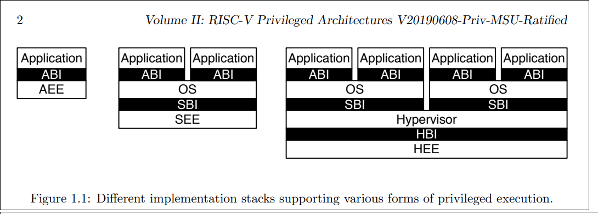

# RISC-V 学习笔记
## RISC-V Privileged Architecture

### RISC-V Privileged Software Stack Terminology
understand the img below

  

## Control and Status Registers (CSRs)

### CSR Address Mapping Conventions
The standard RISC-V ISA set aside a 12-bit encoding space for up to 4096 CSRs.  
[11:8] -> encode the read and write accessibility
[11:10] -> indicate whether the register is read/write (00,01, or 10) or read-only.  
[9:8] -> encode the lowesr privilege level that can access the CSR.  

### CSR Field Specifications
+ WPRI
+ WLRL
+ WARL

### CSR Width Modulation

+ The value of the previous-width CSR is copied to a temporary register of the same width.
+ For the read-only bits of the previous-width CSR, the bits at the same positions int the temporary register are set to zeros.
+ The width of the temporary register is changed to the new width. New narrower, discard. New wider, zero-extended.
+ Each writable field of the new-width CSR takes the value of the bits at the same positions in the temporary register.

## Machine-Level ISA, Version 1.11

### Machine-Level CSRs

#### Machine ISA Register misa
+ misa must be readable in any implementation
+ The MXL field encodes the native base integer ISA width
+ The misa CSSR is MXLEN bits wide. If the value read from misa is nonezero, field MXL of that value always denotes the current MXLEN.
+ if a write to misa causes MXLEN to change, the position of MXL moves to the most-significant two bits of misa at the new width.
+ The Extensions field encodes the presence of the standard extensions, with a single bit per letter of the alphabet.
+ The Extensions field is a WARL field that can contain writable bits where the implementation allows the supported ISA to be modified.
+ The "E" bit is read-only. Unless misa is hardwired to zero, the "E" bit always read as the complement of the "I" bit. An implementation that supports both RV32E and RV32I can select RV32E by clearing the "i" bit.
+ All bits that are reserved for future use must return zero when read.
+ If an ISA feature `x` depends on an ISA feature `y`, then attempting to enable feature `x` but disable feature `y` results in both features being disabled.
+ 

