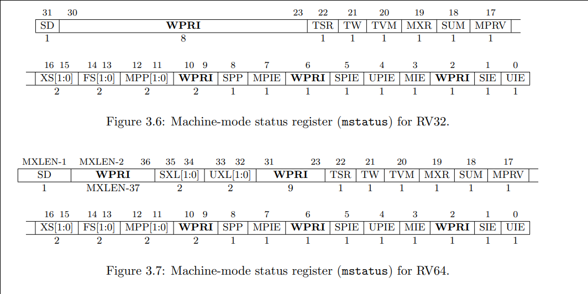

# RISC-V 学习笔记
## RISC-V Privileged Architecture

### RISC-V Privileged Software Stack Terminology
understand the img below

  

## Control and Status Registers (CSRs)

### CSR Address Mapping Conventions
The standard RISC-V ISA set aside a 12-bit encoding space for up to 4096 CSRs.  
[11:8] -> encode the read and write accessibility
[11:10] -> indicate whether the register is read/write (00,01, or 10) or read-only.  
[9:8] -> encode the lowesr privilege level that can access the CSR.  

### CSR Field Specifications
+ WPRI
+ WLRL
+ WARL

### CSR Width Modulation

+ The value of the previous-width CSR is copied to a temporary register of the same width.
+ For the read-only bits of the previous-width CSR, the bits at the same positions int the temporary register are set to zeros.
+ The width of the temporary register is changed to the new width. New narrower, discard. New wider, zero-extended.
+ Each writable field of the new-width CSR takes the value of the bits at the same positions in the temporary register.

## Machine-Level ISA, Version 1.11

### Machine-Level CSRs

#### Machine ISA Register `misa`
+ misa must be readable in any implementation
+ The MXL field encodes the native base integer ISA width
+ The misa CSSR is MXLEN bits wide. If the value read from misa is nonezero, field MXL of that value always denotes the current MXLEN.
+ if a write to misa causes MXLEN to change, the position of MXL moves to the most-significant two bits of misa at the new width.
+ The Extensions field encodes the presence of the standard extensions, with a single bit per letter of the alphabet.
+ The Extensions field is a WARL field that can contain writable bits where the implementation allows the supported ISA to be modified.
+ The "E" bit is read-only. Unless misa is hardwired to zero, the "E" bit always read as the complement of the "I" bit. An implementation that supports both RV32E and RV32I can select RV32E by clearing the "i" bit.
+ All bits that are reserved for future use must return zero when read.
+ If an ISA feature `x` depends on an ISA feature `y`, then attempting to enable feature `x` but disable feature `y` results in both features being disabled.

#### Machine Vendor ID Register `mvendorid`
+ This register must be readable in any implementation, but a value of 0 can be returned to indicate the field is not implemented or that this is a non-commercial implementation.
+ `mvendorid` encodes the number of one-byte continuation codes in the Bank field, and encodes the final byte in the Offset field, discarding the parity bit.

#### Machine Architecture ID Register `marchid`
+ This register must be readable in any implementation, but a value of 0 can be returned to indicate the field is not implemented.
+ The combination of `mvendorid` and `marchid` should uniquely identify the type of hart micro-architecture that is implemented.

#### Machine Implementation ID Register `mimpid`
+ This register must be readable in any implementation, but a value of 0 can be returned to indicate the field is not implemented.
+ The Implementation value should reflect the design of the RISC-V processor itself and not any surrounding system.

#### Hart ID Register `mhartid`
+ Hart IDs might not necessarily be numbered contiguously in a multiprocessor system, but at least one hart must have a hart ID of zero.

#### `Machine Status Register` (`mstaus`)

+ MIE, SIE, UIE: used to guarantee atomicity with repect to interrupt handlers in the current privilege mode.
+ xPIE holds the value of the interrupt-enable bit active prior to the trap, and xPP holds the previous privilege mode. The xPP fields can only hold privilege modes up to x, so MPP is two bits wide, SPP is one bit wide, and UPP is implicitly zero. When a trap is taken from privilege mode y into privilege mode x, xPIE is set to the value of x IE; x IE is set to 0; and xPP is set to y. 
+ The MRET, SRET, or URET instructions are used to return from traps in M-mode, S-mode, or U-mode respectively. When executing an x RET instruction, supposing xPP holds the value y, x IE is set to xPIE; the privilege mode is changed to y; xPIE is set to 1; and xPP is set to U (or M if user-mode is not supported).
+ Whenever XLEN in any mode is set to a value less than the widest supported XLEN, all operations must ignore source operand register bits above the configured XLEN, and must sign-extend results to fill the entire widest supported XLEN in the destination register.
+ Memory Privilege in mstatus Register
+ Virtualization Support in mstatus Register
+ Extension Context Status in `mstatus` Register

#### Machine Trap-Vector Base-Address Register(`mtvec`)
When MODE=Direct, all traps into machine mode cause the pc to be set to the address in the BASE field. When MODE=Vectored, all synchronous exceptions into machine mode cause the pc to be set to the address in the BASE field, whereas interrupts cause the pc to be set to the address in the BASE field plus four times the interrupt cause number. For example, a machine-mode timer interrupt causes the pc to be set to BASE+0x1c.

#### Machine Trap Delegation Registers (`medeleg`, `mideleg`)
In systems with all three privilege modes (M/S/U), setting a bit in medeleg or mideleg will delegate the corresponding trap in S-mode or U-mode to the S-mode trap handler. If U-mode traps are supported, S-mode may in turn set corresponding bits in the sedeleg and sideleg registers to delegate traps that occur in U-mode to the U-mode trap handler. In systems with S-mode, the medeleg and mideleg registers must exist, whereas the sedeleg and sideleg registers should only exist if the N extension for user-mode interrupts is also implemented.

#### Machine Interrupt Registers (`mip` and `mie`)

#### Machine Timer Registers (`mtime` nad `mtimecmp`)

#### Machine Cause Register (`mcause`)

#### Machine Trap Value Register (`mtval`) 

### Machine-Mode Privileged Instructions

#### Environment Call and Breakpoint
#### Trap-Return Instructions
#### Wait for Interrupt Instructions

### Physical Memory Protection

