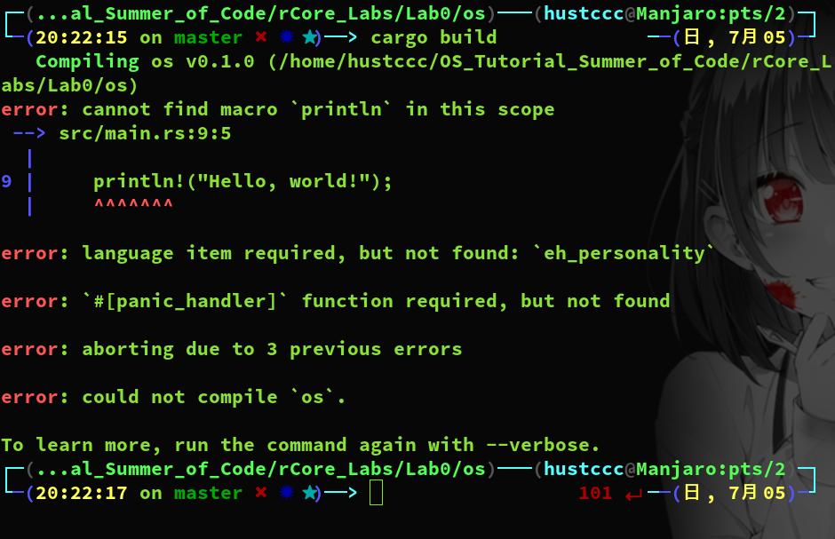
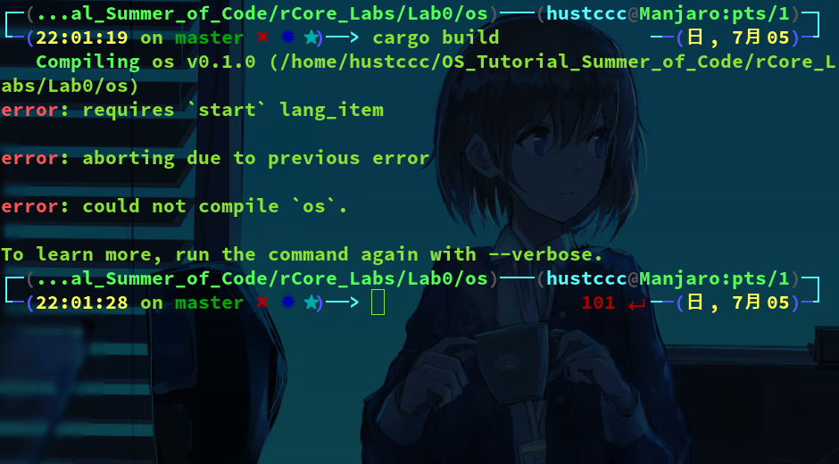
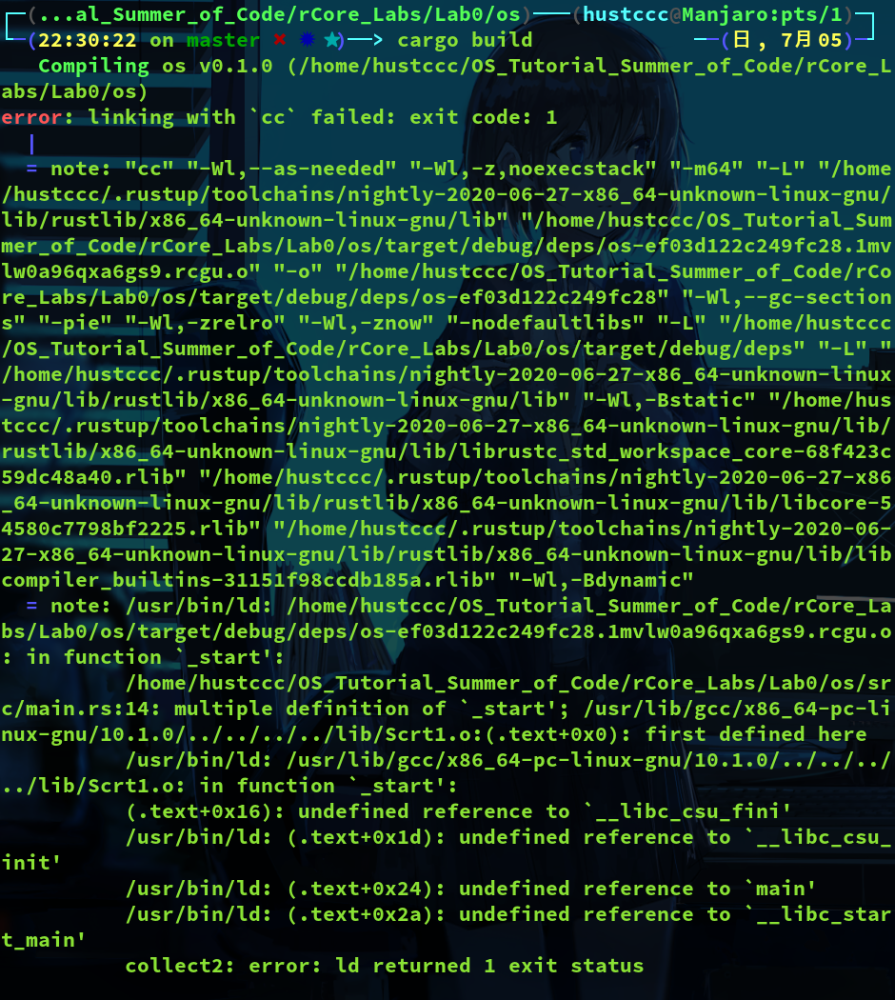
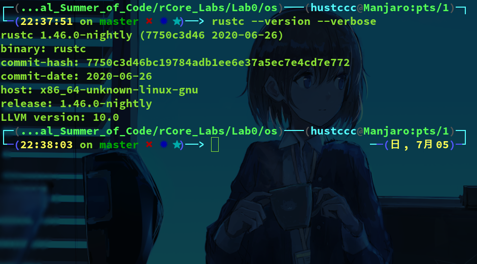
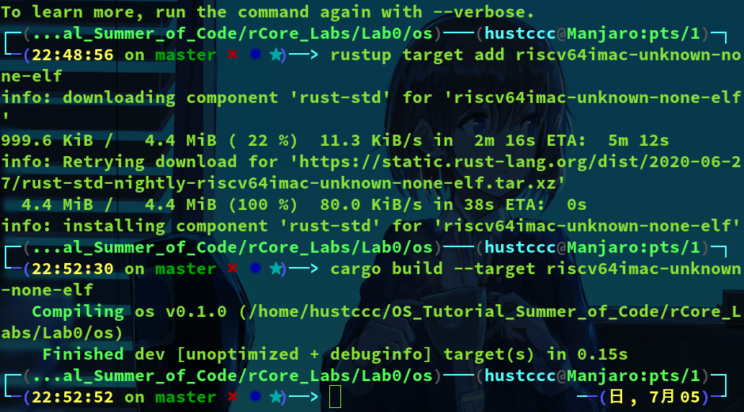

# Lab0 Report

## 实验目的
熟悉用Rust开发OS的一些方法，平台，和qemu模拟器开发环境，为后续实验作准备

## 实验内容
+ 用Rust包管理器cargo创建一个Rust项目
+ 移除Rust程序对操作系统的依赖构建一个独立化可执行的程序
+ 我们将程序的目标平台设置为RISC-V，这样我们的代码将可以在RISC-V指令集的裸机上执行Rust代码
+ 生成内核镜像，调整代码的内存布局并在qemu模拟器中启动
+ 封装如输出，关机等一些SBI的接口，方便后续开发

## 实验步骤
1. 创建项目
2. 移除标准库依赖
3. 移除运行时环境依赖
4. 编译为裸机目标
5. 生成内核镜像
6. 调整内存布局
7. 重写程序入口点
8. 使用qemu运行
9. 接口封装和代码整理

## 实验过程
### 创建项目
在$HOME/OS_Summer_of_Code/rCore_Labs/创建Lab0工作目录，在该工作目录下创建rust-toolchain文件，写入工具链版本：  
```
nightly-2020-06-27
```
然后在此目录下创建Rust项目os  
```
cargo new os
```
（cargo会下载一些东西，需要30分钟左右）  
尝试运行项目  
```
cargo run
...
Hello, world!
```

### 移除标准库依赖
通过显示添加`#![no_std]`禁用标准库  
```
/*
 * rCore Labs: Lab 0
 * 2020/7/5
 * hustccc
 * Manjaro
 */
#![no_std]
fn main() {
    println!("Hello, world!");
}
```
cargo build构建项目，出现以下错误：  
  
第一个错误指出println!宏没找到，因为这个宏属于Rust标准库std，于是将这个println!语句删除。  
第二个错误指出需要一个函数作为panic_handler，这个函数负责在程序发生panic时调用。它默认使用标准库std中实现的函数并依赖于操作系统特殊的文件描述符。  
下面是自己实现panic!函数：  
```
//os/src/main.rs
use core::panic::PanicInfo;
#[panic_handler]
fn panic(_info: &PanicInfo) -> ! {
    loop {}
}
```
第三个错误提到了语义项，它是编译器内部所需的特殊函数和类型。  
这个错误相关语义项`eh_personality`是一个标记某函数用来实现堆栈展开处理功能的语义项。  
为了简单起见，当程序出现异常时莓，我们不会进一步捕获异常也不清理现场，我们设置为直接退出程序即可。  修改项目配置文件`Cargo.toml`  
```
//os/Cargo.toml
...
# exit when panic occur
[profile.dev]
panic = "abort"

[profile.release]
panic = "abort"
```
尝试编译：  
  

### 移除运行时环境依赖
这里，我们的程序遗失了`start`语言项，它定义一个程序的`入口点`。  
大多数语言都拥有一个`运行时系统`，它通常为`垃圾回收`或者`绿色线程`。  
一个典型的使用标准库的Rust程序，它的运行将从名为`crt0`的运行时库开始。`crt0`能建立一个适合运行C语言程序的环境，这包含了栈的创建和可执行程序参数的传入。这之后，这个运行时库会调用`Rust的运行时入口点`，这个入口点被称为`start语言项`。这之后，运行时将会调用main函数。  
我们的独立式可执行程序并不能访问Rust运行时或`crt0`库，所以我们需要定义自己的入口点。下面我们重写整个`crt0`库和它定义的入口点。  
添加`#![no_main]`属性告诉Rust编译器不使用预订义的入口点：  
```
#![no_std]
#![no_main]

use core::panic::PanicInfo;
...
```
编写一个`_start`函数：  
```
#[no_mangle]
pub extern "C" fn _start() -> ! {
    loop {}
}
```
用`no_mangle`标记这个函数来对它禁用名称重整。  
再次构建`cargo build`：  
  
出现了`链接器错误`
### 编译为裸机目标
`链接器`是一个程序，它将生成的目标文件组合成一个可执行文件，它的默认配置假定程序依赖于C语言的运行时环境，但我们的程序没有。  
我们通过编译为`裸机目标`来解决这个错误。  
Rust使用一个称为`目标三元组`的字符串来描述不同的环境。运行`rustc --version --verbose`查看当前系统的目标三元组：  
  
Rust编译器尝试为当前系统的三元组编译，并假定底层有一个类似于Linux的操作系统提供C语言运行环境，这就是导致链接器错误的原因。为了避免这个错误，我们另选一个底层没有操作系统的运行环境，即为裸机环境。  
```
rustup target add riscv64imac-unknown-none-elf
cargo build --target riscv64imac-unknown-none-elf	//build
```
传递`--target`参数来为裸机目标系统交叉编译。  
运行结果：  
  
为了后续方便编译，在`os`文件夹中创建一个`.cargo`文件夹，并在其中创建一个名为config的文件，修改其中的内容：  

```
[build]
target = "riscv64imac-unknown-none-elf"
```
这样可以直接使用`cargo build`来编译。

## 实验总结