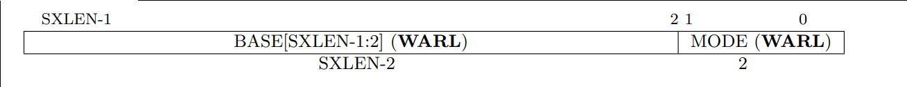
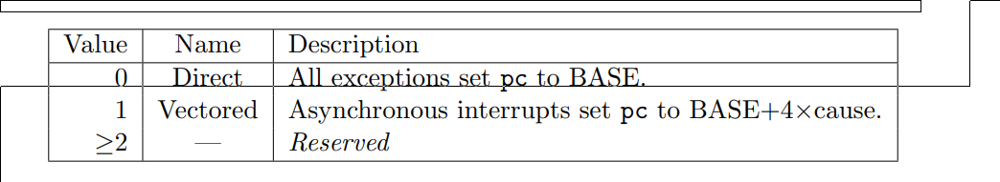
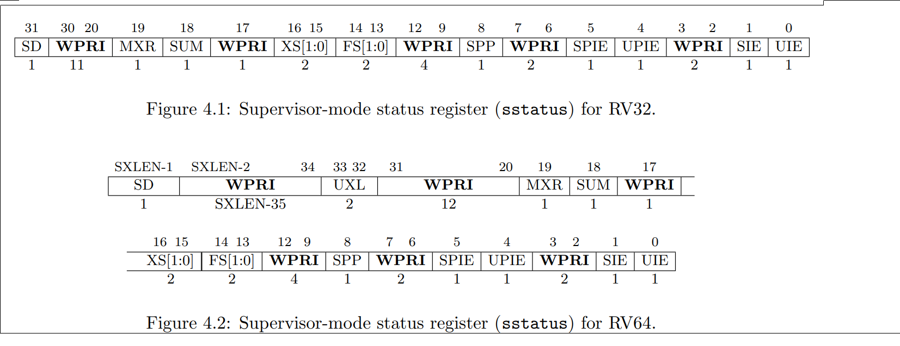
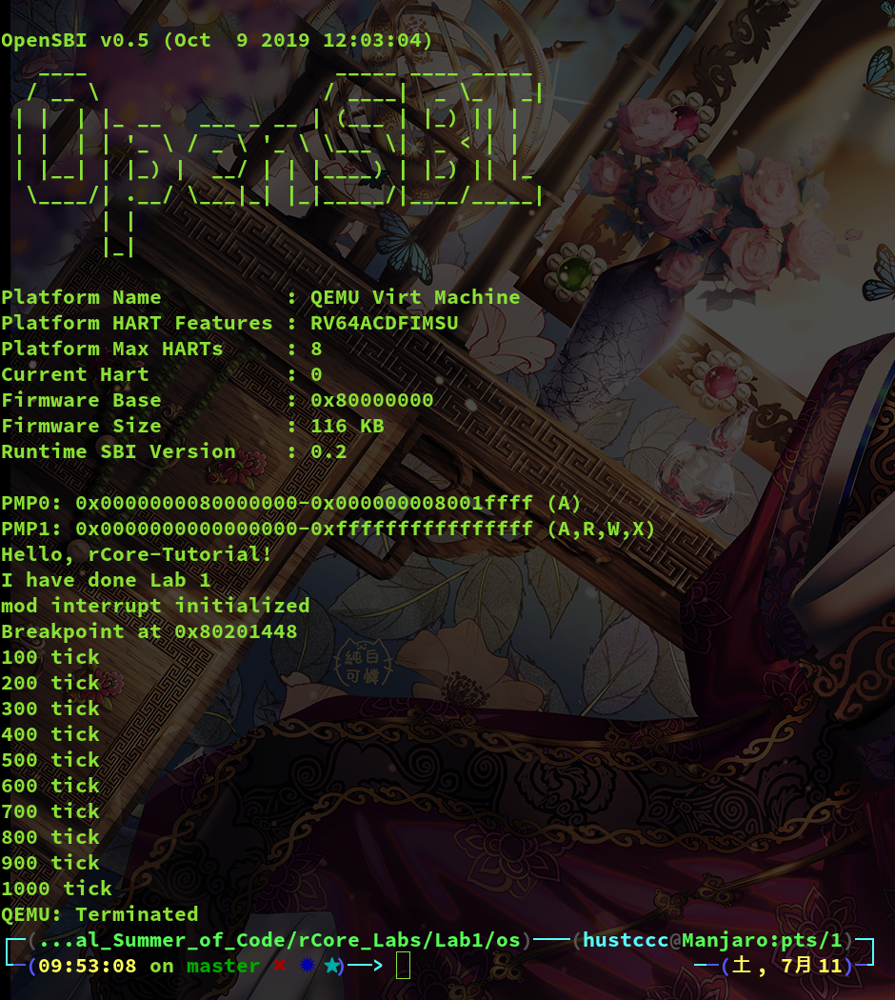

# rCore Tutorial Lab 学习报告

## **TOC**
* [Lab0](#lab0)  
* [Lab1](#lab1)  
* [Lab2](#lab2)  
* [Lab3](#lab3)  
* [Lab4](#lab4)  
* [Lab5](#lab5)  
* [Lab6](#lab6)  

<span id="lab0"></span>

## Lab0

<span id="lab1"></span>
## Lab1
### 引言
本文是本人在详细阅读` rCore-Tutorial Lab1 `的实验指导，并仔细分析了实验代码中` interrupt `部分的代码之后，结合` RISC-V `特权指令规范文档，按照实验指导中文档格式规范编写的学习报告，对` RISC-V `架构下中断处理机制做了一遍梳理，并结合代码来分析实验代码在中断机制这个模块中是怎么实现的。另外，本人对实验指导和实验源码中提出的几个思考作出了自己的看法，并提出了对源码中某处实现方式合理性的疑问和改进方法。最后，本人尝试在现有代码基础上，为实验代码实现中断嵌套调用的处理机制，包括提出实现思路和尝试修改代码实现。  
本次实验学习报告将紧密结合代码来进行对中断处理机制的梳理，中间穿插` RISC-V `架构知识，目的是通过实践代码来直观地理解操作系统是如何处理中断机制的。  

### 什么是中断
首先来简单地了解一下什么是中断。  
中断这个概念在很多教科书，网站上都有或相同或不同的介绍，下面是本人觉得比较准确的一个说法：  
**中断是一种使 CPU 中止正在执行的程序而转去处理特殊事件的操作，这些引起中断的事件称为中断源，它们可能是来自外设的输入输出请求，也可能是计算机的一些异常事故或其他原因**  
此概念引用自清华大学出版的《80x86汇编语言程序设计》一书。  
中断有以下三种：  
+ 异常（Exception）：指令产生的，通常无法预料的错误。例如：访问无效地址，除零操作；
+ 陷阱（Trap）：一系列强行导致中断的指令，例如：系统调用；
+ 硬件中断（Hardware Interrupt）：由 CPU 之外的硬件产生的异步中断，例如：时钟中断。  

中断的作用：  
+ 处理 CPU 某些错误；
+ 提供程序调试功能（断点中断和单步中断）；
+ 与外部设备进行 I/O 通信。  

### 中断流程
+ 中断源产生中断
+ 获取中断入口
+ 开启中断使能
+ 保存当前上下文
+ 进入中断处理程序
+ 处理中断
+ 中断返回
+ 恢复上下文
+ 继续执行程序

在Linux等成熟的操作系统中，中断机制还要更为复杂，比如在Linux安全模式下的中断是通过中断描述符来定位中断处理程序。不过大体上的流程是一样的。在这里只是根据实验代码的实现来分析中断处理过程。  
在分析中断过程之前，还需要补充几个基础概念。  

### 上下文（Context）
上下文可以理解为当前系统的寄存器状态，在进入中断处理程序前需要保存当前上下文。
在实验代码中，上下文使用一个数据结构来抽象：  
` os/src/interrupt/context.rs `  
```Rust
#[repr(C)]
#[derive(Clone, Copy)]
pub struct Context {
    /// 通用寄存器
    pub x: [usize; 32],
    /// 保存诸多状态位的特权态寄存器
    pub sstatus: Sstatus,
    /// 保存中断地址的特权态寄存器
    pub sepc: usize,
}
```
可以看到这个` context `数据结构保存了 32 个通用寄存器，` sstatus `特权态寄存器和` sepc `特权态寄存器。  
这里我们不将` scause `和` stval `寄存器放在` Context `中，至于为什么这么做本人的猜测会在后面提到，这也将结合到其中一个思考题来综合考虑。  

### 特权级（Privilege Levels）
在` RISC-V `架构中，目前定义了三个特权级：  
+ Machine (M)
+ Supervisor (S)
+ User (U)

其中 Machine 特权级级别最高，Supervisor 特权级其次，User 特权级最低。  
特权级用来为 software 的不同部分提供保护，尝试进行当前特权级不允许的操作将会引起异常。  
更多关于` RISC-V `架构的详细内容请查阅[RISC-V特权指令规范](https://riscv.org/specifications/privileged-isa/)  

### 特权级寄存器
这里集中梳理一遍在中断处理中主要涉及到的几个 S 特权级寄存器，即` Supervisor CRSs `。  
#### Supervisor Trap Vector Base Address Register (stvec)
在官方文档中对` stvec `的描述：  
> The stvec register is an SXLEN-bit read/write register that holds trap vector configuration, consisting of a vector base address (BASE) and a vector mode (MODE).  

结合下面这幅图来理解：  
  
` stvec `寄存器是保存发生异常时 CPU 需要跳转到的地址。其中 BASE 字段保存着有效的虚拟地址或物理地址，这个地址必须四字节对齐。MODE 字段将会决定寻址方式。  

  
也就是说，MODE 字段为 Direct（0）的话，BASE 字段直接指向需要跳转的地址；若 MODE 字段为 Vectored 的话，BASE + 4 × cause 指向需要跳转的地址。  

#### Supervisor Exception Program Counter （sepc）
在官方文档中对` sepc `的描述：  
> sepc is a WARL register that must be able to hold all valid physical and virtual addresses. It
need not be capable of holding all possible invalid addresses. Implementations may convert some
invalid address patterns into other invalid addresses prior to writing them to sepc.   
> When a trap is taken into S-mode, sepc is written with the virtual address of the instruction
that was interrupted or that encountered the exception. Otherwise, sepc is never written by the
implementation, though it may be explicitly written by software.  
在发生异常时，` sepc `将会保存发生异常的指令的地址。  

#### Supervisor Status Register (sstatus)
在官方文档中对` sstatus `的描述：  
> The sstatus register is an SXLEN-bit read/write register formatted as shown in Figure 4.1 for
RV32 and Figure 4.2 for RV64. The sstatus register keeps track of the processor’s current operating
state.  

结合下面这幅图来理解：  

  
` sstatus `是` supervisor `模式下的状态寄存器，它保存着全局中断使能，以及许多其他状态。  
需要注意的一点是，CPU 在 S 模式下运行时，只有在全局中断使能位 sstatus.SIE 置 1 时才会产生中断。每个中断在控制状态寄存器` sie `中都有自己的使能位，位置对应于一个中断代码。  

####  Supervisor Interrupt Registers (sip and sie)
分别简单说明一下这两个特权级寄存器：  
+ ` sie `指出 CPU 目前能处理和必须忽略的中断；
+ ` sip `列出目前正准备处理的中断。

将上面三个控制状态寄存器合在一起考虑，如果 sstatus.SIE = 1, sie[7] = 1，且 sip[7] = 1，则可以处理机器的时钟中断。  

#### Supervisor Cause Register (scause)
在官方文档中对` scause `的描述：  
> The scause register is an SXLEN-bit read-write register formatted as shown in Figure 4.9. When a trap is taken into S-mode, scause is written with a code indicating the event that caused the trap.
Otherwise, scause is never written by the implementation, though it may be explicitly written by
software.  
> The Interrupt bit in the scause register is set if the trap was caused by an interrupt. The Exception Code field contains a code identifying the last exception. Table 4.2 lists the possible exception codes for the current supervisor ISAs. The Exception Code is a WLRL field, so is only guaranteed to hold supported exception codes.  

也就是说` scause `指示发生异常的种类，Interrupt 字段置 1 表示这个` trap `是中断引起的。Exception Code 字段将发生异常的原因更细地分类。更多内容请查阅文档[RISC-V特权指令规范](https://riscv.org/specifications/privileged-isa/)  

#### Supervisor Trap Value (stval) Register
在官方文档中对` stval `的描述：  
> The stval register is an SXLEN-bit read-write register formatted as shown in Figure 4.10. When
a trap is taken into S-mode, stval is written with exception-specific information to assist software
in handling the trap. Otherwise, stval is never written by the implementation, though it may
be explicitly written by software. The hardware platform will specify which exceptions must set
stval informatively and which may unconditionally set it to zero.  
简单地说就是它保存了` trap `的附加信息：出错的地址或者非法指令本身，对于其他异常它的值为 0 。  

#### Supervisor Scratch Register (sscratch)
在官方文档中对` sscratch `的描述：  
> The sscratch register is an SXLEN-bit read/write register, dedicated for use by the supervisor.
Typically, sscratch is used to hold a pointer to the hart-local supervisor context while the hart is
executing user code. At the beginning of a trap handler, sscratch is swapped with a user register
to provide an initial working register.  

在核（` hart `）运行用户态代码的时候，` sscratch `用来保存一个指向内核态上下文的指针。在` trap handler `的开始部分，` sscratch `和一个用户寄存器交换值来提供一个`initial working register`。  
这个寄存器的说明比较抽象，我们会在后面实验过程中分析相关代码来感受这个寄存器的用法和功能。  
这八个控制状态寄存器（CSR）是` supervisor`模式下异常处理的必要部分。这里只是简单地说明一下，更全面的内容请查阅文档[RISC-V特权指令规范](https://riscv.org/specifications/privileged-isa/)  

### 特权级指令（Supervisor Instructions）
由于这次实验涉及到的 CSR Intruction 并不复杂，数量也不多，因此这里照搬实验指导中相关的介绍。更详细的内容请查阅文档[RISC-V特权指令规范](https://riscv.org/specifications/privileged-isa/)  
+ ` csrrw dst, csr, src ` (CSR Read Write)：同时读写的原子操作，将指定 CSR 的值写入` dst `，同时将` src `的值写入 CSR。
+ ` csrr dst, csr `(CSR Read)：仅读取一个 CSR 寄存器。
+ ` csrw csr, src `(CSR Write)：仅写入一个 CSR 寄存器。
+ `csrc(i) csr, rs1 `(CSR Clear)：将 CSR 寄存器中指定的位清零，` csrc `使用通用寄存器作为 mask ，` csrci `则使用立即数。
+ ` csrs(i) csr, rs1 `(CSR Set)：将 CSR 寄存器中指定的位置 1 ，` csrc `使用通用寄存器作为 mask ，` csrci `则使用立即数。

下面将正式进入中断过程分析。  

### 获取中断入口和开启中断使能
在对 CRSs 介绍部分提到了` stvec `，这个寄存器保存着 CPU 发生异常时需要跳转的地址。在实验代码中，有一个用汇编语言写的函数` __interrupt `用于状态保存，调用中断处理程序等工作，这个函数的地址就是我们需要跳转的中断入口，而我们要做的，就是把这个中断入口写入到` stvec `中。  
本次实验所分析的代码全部在` os/src/interrupt `目录下，而获取中断入口和开启中断使能的工作在` os/src/interrupt/handler.rs `文件中完成。  
下面是` os/src/interrupt/handler.rs `中的部分源码：  
` os/src/interrupt/handler.rs `  
```Rust
/// 初始化中断处理
///
/// 把中断入口 `__interrupt` 写入 `stvec` 中，并且开启中断使能
pub fn init() {
    unsafe {
        extern "C" {
            /// `interrupt.asm` 中的中断入口
            fn __interrupt();
        }
        // 使用 Direct 模式，将中断入口设置为 `__interrupt`
        stvec::write(__interrupt as usize, stvec::TrapMode::Direct);

        // 开启外部中断使能
        sie::set_sext();

        // 在 OpenSBI 中开启外部中断
        *PhysicalAddress(0x0c00_2080).deref_kernel() = 1u32 << 10;
        // 在 OpenSBI 中开启串口
        *PhysicalAddress(0x1000_0004).deref_kernel() = 0x0bu8;
        *PhysicalAddress(0x1000_0001).deref_kernel() = 0x01u8;
        // 其他一些外部中断相关魔数
        *PhysicalAddress(0x0C00_0028).deref_kernel() = 0x07u32;
        *PhysicalAddress(0x0C20_1000).deref_kernel() = 0u32;
    }
}
```
上面提到过我们需要将中断入口写入到` stvec `中，实现一步的就是上面代码中的这一行：  
` os/src/interrupt/handler.rs `  
```Rust
stvec::write(__interrupt as usize, stvec::TrapMode::Direct);
```
使用 Direct 模式，将中断入口设置为` __interrupt `。我们在上面提到过` stvec `的 MODE 字段将会决定目标地址的寻址方式。这里设置为 Direct ，意味着` __interrupt `即为跳转地址。` stvec::write `传入` __interrupt `和` stvec::TrapMode::Direct 参数`，将` stvec `的 BASE 字段设置为` __interrupt `的地址，MODE 字段设置为 Direct ，这样完成了中断入口的获取。可以看到，利用 Rust 的 riscv 库，可以很方便地完成这一工作。  
然后我们来看一下下一行代码：  
` os/src/interrupt/handler.rs `  
```Rust
sie::set_sext();
```
很容易可以猜出这行代码做了什么工作。之前介绍特权级寄存器的时候提到：  
` sie `指出 CPU 目前能处理和必须忽略的中断。  
因此这行代码的作用就是开启中断使能，但我们知道中断有很多种，分别对应` sie `中的各个使能位，这里开启的是哪种中断呢？  
Ctrl + 鼠标左键去看看源码，跳转到下面这个位置：  
`...sie.rs`
```Rust
set_clear_csr!(
    /// Supervisor External Interrupt Enable
    , set_sext, clear_sext, 1 << 9);
```
从注释 Supervisor External Interrupt Enable 可以看出是开启了外部中断使能。  
最后看剩下几行代码：  
` os/src/interrupt/handler.rs `  
```Rust
// 在 OpenSBI 中开启外部中断
*PhysicalAddress(0x0c00_2080).deref_kernel() = 1u32 << 10;
// 在 OpenSBI 中开启串口
*PhysicalAddress(0x1000_0004).deref_kernel() = 0x0bu8;
*PhysicalAddress(0x1000_0001).deref_kernel() = 0x01u8;
// 其他一些外部中断相关魔数
*PhysicalAddress(0x0C00_0028).deref_kernel() = 0x07u32;
*PhysicalAddress(0x0C20_1000).deref_kernel() = 0u32;
```
这里查看一下` deref_kernel() `的源码：  
` ...address.rs `
```Rust
/// 从物理地址经过线性映射取得 &mut 引用
pub fn deref_kernel<T>(self) -> &'static mut T {
	VirtualAddress::from(self).deref()
    }
```
再查看一下` deref() `的源码：  
` ...address.rs `
```Rust
pub fn deref<T>(self) -> &'static mut T {
        unsafe { &mut *(self.0 as *mut T) }
    }
```
可以分析出这个` PhysicalAddress `类中的方法会从物理地址经过线性映射到虚拟地址，并从中获得一个类型的引用。  
再结合中文注释猜测上面的代码块通过对特定物理地址映射到的虚拟地址的内存进行赋值，来完成在OpenSBI中开启外部中断的工作。开启中断后，就会进入中断入口进行一系列中断处理的过程。  
### 上下文保存
我们在前面已经提到了一个用于保存上下文的数据结构` Context `：  
` os/src/interrupt/context.rs `  
```Rust
#[repr(C)]
#[derive(Clone, Copy)]
pub struct Context {
    /// 通用寄存器
    pub x: [usize; 32],
    /// 保存诸多状态位的特权态寄存器
    pub sstatus: Sstatus,
    /// 保存中断地址的特权态寄存器
    pub sepc: usize,
}
```
在实验代码中，上下文的保存和恢复采用以下方法：  
先用栈上的一小段空间来把需要保存的全部通用寄存器和 CSR 寄存器保存在栈上，保存完之后在跳转到 Rust 编写的中断处理函数；而对于恢复，则直接把备份在栈上的内容写回寄存器。  
由于程序涉及到了寄存器级别的操作，因此我们使用汇编语言来实现，这部分操作由汇编文件` os/src/interrupt/interrupt.asm `来实现，为了文档的整洁，这里将该文件中的代码分模块进行分析。  
这个文件里首先定义了两个宏用于内存读写操作：  
` os/src/interrupt/interrupt.asm `  
```
# 宏：将寄存器存到栈上
.macro SAVE reg, offset
    sd  \reg, \offset*8(sp)
.endm

# 宏：将寄存器从栈中取出
.macro LOAD reg, offset
    ld  \reg, \offset*8(sp)
.endm
```
这段宏代码十分容易理解，中文注释也写出了它们的作用，就是通过传递两个参数，寄存器和相对于栈顶的偏移量，来进行对栈空间内存的读写操作。  
然后下面一段代码就是对上下文的保存：  
` os/src/interrupt/interrupt.asm `  
```
    .section .text
    .globl __interrupt
# 进入中断
# 保存 Context 并且进入 Rust 中的中断处理函数 interrupt::handler::handle_interrupt()
__interrupt:
    # 因为线程当前的栈不一定可用，必须切换到内核栈来保存 Context 并进行中断流程
    # 因此，我们使用 sscratch 寄存器保存内核栈地址
    # 思考：sscratch 的值最初是在什么地方写入的？

    # 交换 sp 和 sscratch（切换到内核栈）
    csrrw   sp, sscratch, sp
    # 在内核栈开辟 Context 的空间
    addi    sp, sp, -36*8
    
    # 保存通用寄存器，除了 x0（固定为 0）
    SAVE    x1, 1
    # 将本来的栈地址 sp（即 x2）保存
    csrr    x1, sscratch
    SAVE    x1, 2
    SAVE    x3, 3
    SAVE    x4, 4
    SAVE    x5, 5
    SAVE    x6, 6
    SAVE    x7, 7
    SAVE    x8, 8
    SAVE    x9, 9
    SAVE    x10, 10
    SAVE    x11, 11
    SAVE    x12, 12
    SAVE    x13, 13
    SAVE    x14, 14
    SAVE    x15, 15
    SAVE    x16, 16
    SAVE    x17, 17
    SAVE    x18, 18
    SAVE    x19, 19
    SAVE    x20, 20
    SAVE    x21, 21
    SAVE    x22, 22
    SAVE    x23, 23
    SAVE    x24, 24
    SAVE    x25, 25
    SAVE    x26, 26
    SAVE    x27, 27
    SAVE    x28, 28
    SAVE    x29, 29
    SAVE    x30, 30
    SAVE    x31, 31

    # 取出 CSR 并保存
    csrr    t0, sstatus
    csrr    t1, sepc
    SAVE    t0, 32
    SAVE    t1, 33
    # 调用 handle_interrupt，传入参数
    # context: &mut Context
    mv      a0, sp
    # scause: Scause
    csrr    a1, scause
    # stval: usize
    csrr    a2, stval
    jal handle_interrupt

```
线程当前的栈不一定可用，因此需要切换到内核栈来保存` Context `并进行中断流程。内核栈地址保存在` sscratch 中 `，因此交换` sp `和` sscratch `：  
` os/src/interrupt/interrupt.asm `  
```
csrrw   sp, sscratch, sp
```
现在` sp `指向了内核栈的地址，可以通过减少` sp `的值来在内核栈开辟一片空间来存储` Context `：  
` os/src/interrupt/interrupt.asm `  
```
addi    sp, sp, -36*8
```
这样就开辟了一片 36×8 大小的空间来保存` Context `，下面保存通用寄存器 x1～x2 ：  
` os/src/interrupt/interrupt.asm `  
```
# 保存通用寄存器，除了 x0（固定为 0）
    SAVE    x1, 1
    # 将本来的栈地址 sp（即 x2）保存
    csrr    x1, sscratch
    SAVE    x1, 2
    SAVE    x3, 3
    SAVE    x4, 4
    SAVE    x5, 5
    SAVE    x6, 6
    SAVE    x7, 7
    SAVE    x8, 8
    SAVE    x9, 9
    SAVE    x10, 10
    SAVE    x11, 11
    SAVE    x12, 12
    SAVE    x13, 13
    SAVE    x14, 14
    SAVE    x15, 15
    SAVE    x16, 16
    SAVE    x17, 17
    SAVE    x18, 18
    SAVE    x19, 19
    SAVE    x20, 20
    SAVE    x21, 21
    SAVE    x22, 22
    SAVE    x23, 23
    SAVE    x24, 24
    SAVE    x25, 25
    SAVE    x26, 26
    SAVE    x27, 27
    SAVE    x28, 28
    SAVE    x29, 29
    SAVE    x30, 30
    SAVE    x31, 31
```
注意这里对原来` x2 `（即` sp `）的保存，已经和` sscratch `交换，因此保存的是` sscratch `的值。  
下面是对` sstatus `和` sepc `的保存：  
` os/src/interrupt/interrupt.asm `  
```
# 取出 CSR 并保存
    csrr    t0, sstatus
    csrr    t1, sepc
    SAVE    t0, 32
    SAVE    t1, 33
```
这里先用` csrr `指令将` sstatus `和` sepc `取出到` t0 `和` t1 `中保存，然后再用 SAVE 宏保存在内核栈中。  
最后是调用中断处理函数之前的参数准备和跳转到中断处理函数中执行：  
` os/src/interrupt/interrupt.asm `  
```
# 调用 handle_interrupt，传入参数
    # context: &mut Context
    mv      a0, sp
    # scause: Scause
    csrr    a1, scause
    # stval: usize
    csrr    a2, stval
    jal handle_interrupt
```
在` RISC-V `架构的函数调用规范中，我们约定寄存器 a0～a7 用于保存调用参数，且 a0，a1 用于传递返回值。因此这里将指向一个` Context `的指针，` scause `和` stval `分别保存在` a0 `，` a1 `和` a2 `中作为参数传递。   
最后一条` jal `指令将跳转到 handle_interrupt 函数中执行并设置好返回地址。  
这里有个问题，为什么要传递` scause `和` stval `这两个参数？  
在前面对这两个特权级寄存器的介绍中提到过，` scause `指示发生异常的种类，而` stval `保存了` trap `的附加信息：出错的地址或者非法指令本身。因此我们通过传递这两个参数让中断处理程序知道引起中断的原因是什么，以便作出相应的弥补操作。不过貌似实验代码中并没有对` trap `参数进行任何处理，可能这是为了后面的完善开发提供的接口。  
### 进入中断处理程序处理中断
中断处理程序` handle_interrupt `在文件` handler.rs `中。  
` os/src/interrupt/handler.rs `  
```Rust
/// 中断的处理入口
///
/// `interrupt.asm` 首先保存寄存器至 Context，其作为参数和 scause 以及 stval 一并传入此函数
/// 具体的中断类型需要根据 scause 来推断，然后分别处理
#[no_mangle]
pub fn handle_interrupt(context: &mut Context, scause: Scause, stval: usize) -> *mut Context {
    // 返回的 Context 必须位于放在内核栈顶
    match scause.cause() {
        // 断点中断（ebreak）
        Trap::Exception(Exception::Breakpoint) => breakpoint(context),
        // 系统调用
        Trap::Exception(Exception::UserEnvCall) => syscall_handler(context),
        // 时钟中断
        Trap::Interrupt(Interrupt::SupervisorTimer) => supervisor_timer(context),
        // 外部中断（键盘输入）
        Trap::Interrupt(Interrupt::SupervisorExternal) => supervisor_external(context),
        // 其他情况，终止当前线程
        _ => fault(context, scause, stval),
    }
}
```
这就是在` interrupt.asm `中跳转的中断处理函数了，可以看到这里使用 match 对` scause `进行模式匹配，来判断是哪种类型的中断，并且给出了对应的中断处理：  
` os/src/interrupt/handler.rs `  
```Rust
/// 处理 ebreak 断点
///
/// 继续执行，其中 `sepc` 增加 2 字节，以跳过当前这条 `ebreak` 指令
fn breakpoint(context: &mut Context) -> *mut Context {
    println!("Breakpoint at 0x{:x}", context.sepc);
    context.sepc += 2;
    context
}

/// 处理时钟中断
fn supervisor_timer(context: &mut Context) -> *mut Context {
    timer::tick();
    PROCESSOR.get().park_current_thread(context);
    PROCESSOR.get().prepare_next_thread()
}

/// 出现未能解决的异常，终止当前线程
fn fault(_context: &mut Context, scause: Scause, stval: usize) -> *mut Context {
    println!(
        "{:x?} terminated with {:x?}",
        PROCESSOR.get().current_thread(),
        scause.cause()
    );
    println!("stval: {:x}", stval);
    PROCESSOR.get().kill_current_thread();
    // 跳转到 PROCESSOR 调度的下一个线程
    PROCESSOR.get().prepare_next_thread()
}

/// 处理外部中断，只实现了键盘输入
fn supervisor_external(context: &mut Context) -> *mut Context {
    let mut c = console_getchar();
    if c <= 255 {
        if c == '\r' as usize {
            c = '\n' as usize;
        }
        STDIN.push(c as u8);
    }
    context
}
```
这些中断处理有些是用了 Rust 库，有些是使用了其他模块的函数，这里不再继续深入分析。  
这里我们可以看看` Trap `这个枚举定义：  
```Rust
#[derive(Copy, Clone, Debug, Eq, PartialEq)]
pub enum Trap {
    Interrupt(Interrupt),
    Exception(Exception),
}
```
这个枚举有两个成员，` Interrupt `和` Exception `，分别对应中断和异常。下面再看一下` Interrupt `和` Exception `这两种枚举类型的定义：  
```Rust
/// Interrupt
#[derive(Copy, Clone, Debug, Eq, PartialEq)]
pub enum Interrupt {
    UserSoft,
    SupervisorSoft,
    UserTimer,
    SupervisorTimer,
    UserExternal,
    SupervisorExternal,
    Unknown,
}

/// Exception
#[derive(Copy, Clone, Debug, Eq, PartialEq)]
pub enum Exception {
    InstructionMisaligned,
    InstructionFault,
    IllegalInstruction,
    Breakpoint,
    LoadFault,
    StoreMisaligned,
    StoreFault,
    UserEnvCall,
    InstructionPageFault,
    LoadPageFault,
    StorePageFault,
    Unknown,
}
```
可以看到` Interrupt `和` Exception `也被细分成了多种类型，对于不同的类型操作系统会作出不同的相应操作。  
### 中断返回和恢复上下文
中断返回和恢复上下文的操作将又回到汇编文件` interrupt.asm `文件中分析。  
在前面的` handle_interrupt `函数中，返回了一个指向` Context `数据结构的指针，这个返回值保存在` a0 `中。实际上，这个指针也是指向内核栈栈顶的。因此下面这行代码将从` a0 `中恢复` sp `：  
` os/src/interrupt/interrupt.asm `  
```
mv      sp, a0
```
而本人对于实验代码中的这种做法持有疑问，这将会在后面的思考环节进行阐述。  
然后就是利用 LOAD 宏恢复` sstatus `，` sepc `：  
` os/src/interrupt/interrupt.asm `  
```
LOAD    t0, 32
LOAD    t1, 33
csrw    sstatus, t0
csrw    sepc, t1
```
最后将内核栈写入` sscratch `，此操作完成后` sscratch `将会和发生中断之前保持一致。  
` os/src/interrupt/interrupt.asm `  
```
addi    t0, sp, 36*8
csrw    sscratch, t0
```
然后是恢复通用寄存器，同样使用 LOAD 宏完成此操作：  
` os/src/interrupt/interrupt.asm `  
```
LOAD    x1, 1
LOAD    x3, 3
LOAD    x4, 4
LOAD    x5, 5
LOAD    x6, 6
LOAD    x7, 7
LOAD    x8, 8
LOAD    x9, 9
LOAD    x10, 10
LOAD    x11, 11
LOAD    x12, 12
LOAD    x13, 13
LOAD    x14, 14
LOAD    x15, 15
LOAD    x16, 16
LOAD    x17, 17
LOAD    x18, 18
LOAD    x19, 19
LOAD    x20, 20
LOAD    x21, 21
LOAD    x22, 22
LOAD    x23, 23
LOAD    x24, 24
LOAD    x25, 25
LOAD    x26, 26
LOAD    x27, 27
LOAD    x28, 28
LOAD    x29, 29
LOAD    x30, 30
LOAD    x31, 31
LOAD    x2, 2
```
注意，这里恢复` x2 `即恢复` sp `，放到最后恢复是为了上面可以正常使用 LOAD 宏。  
最后是中断返回：  
` os/src/interrupt/interrupt.asm `  
```
sret
```
到这里中断处理的代码分析就差不多结束了。本次实验代码还实现了一个比较特殊的中断：时钟中断。下面是对` os/src/interrupt/timer.rs `文件的代码分析。  

### 时钟中断
` os/src/interrupt/timer.rs `文件实现了预约和处理中断。  
中断计数和中断间隔定义：  
` os/src/interrupt/timer.rs `
```Rust
pub static mut TICKS: usize = 0;
static INTERVAL: usize = 100000;
```
和上面分析过的外部中断一样，这里需要设置` sie `开启时钟中断使能，并且预约第一次时钟中断：  
` os/src/interrupt/timer.rs `
```Rust
pub fn init() {
    unsafe {
        // 开启 STIE，允许时钟中断
        sie::set_stimer();
    }
    // 设置下一次时钟中断
    set_next_timeout();
}
```
下面是设置下一次时钟中断的函数实现：  
` os/src/interrupt/timer.rs `
```Rust
fn set_next_timeout() {
    set_timer(time::read() + INTERVAL);
}
```
其中` set_timer `函数是通过 SBI 提供的接口实现的：  
```Rust
pub fn set_timer(time: usize) {
    sbi_call(SBI_SET_TIMER, time, 0, 0);
}
```
` sbi_call `的实现：  
```Rust
/// SBI 调用
#[inline(always)]
fn sbi_call(which: usize, arg0: usize, arg1: usize, arg2: usize) -> usize {
    let mut ret;
    unsafe {
        llvm_asm!("ecall"
            : "={x10}" (ret)
            : "{x10}" (arg0), "{x11}" (arg1), "{x12}" (arg2), "{x17}" (which)
            : "memory"      // 如果汇编可能改变内存，则需要加入 memory 选项
            : "volatile"); // 防止编译器做激进的优化（如调换指令顺序等破坏 SBI 调用行为的优化）
    }
    ret
}
```
其中使用到了内敛汇编，同时发现这段代码也是我们 Lab0 中实现的一部分。  
最后就是时钟中断的函数，这里的设计是每当中断计数到整除 100 时打印中断计数：  
` os/src/interrupt/timer.rs `
```Rust
pub fn tick() {
    set_next_timeout();
    unsafe {
        TICKS += 1;
        if TICKS % 100 == 0 {
            println!("{} tick", TICKS);
        }
    }
}
```
那么这个函数在什么时候调用呢？我们回到` os/src/interrupt/handler.rs `文件，里面处理时钟中断的函数：  
` os/src/interrupt/handler.rs `
```Rust
/// 处理时钟中断
fn supervisor_timer(context: &mut Context) -> *mut Context {
    timer::tick();
    PROCESSOR.get().park_current_thread(context);
    PROCESSOR.get().prepare_next_thread()
}
```
这样思路就很明了了：先是硬件发生时钟中断，然后设置` scause `为时钟中断对应的值，传递到中断处理函数` handle_interrupt `里面，然后根据` scause `执行处理时钟中断的函数，调用` tick（） `，最后中断返回。  

### 运行结果分析
本人参考实验指导，并且结合自己的知识，一步步再现了实验代码的中断模块。下面对运行结果进行测试。项目代码：[lab1-interrupt](https://github.com/SKTT1Ryze/OS_Tutorial_Summer_of_Code/tree/master/rCore_Labs/Lab1/os)  
在` main.rs `中加入死循环，让时钟中断一直触发：  
` os/src/main.rs `  
```Rust
// the first function to be called after _start
#[no_mangle]
pub extern "C" fn rust_main() -> ! {
    println!("Hello, rCore-Tutorial!");
    println!("I have done Lab 1");
    //panic!("Hi,panic here...")
    interrupt::init();

    unsafe {
        llvm_asm!("ebreak"::::"volatile");
    };
    //unreachable!();
    loop{};
}
```
在时钟中断处理函数` tick() `中打印当前中断计数：  
` os/src/interrupt/timer.rs `
```Rust
pub fn tick() {
    set_next_timeout();
    unsafe {
        TICKS += 1;
        if TICKS % 100 == 0 {
            println!("{} tick", TICKS);
        }
    }
}
```
运行结果如下：  
  

### 思考
在分析 Lab1 的代码过程中，遇到一些问题，其中包括在源码中注释的思考题，和我本人对实验代码提出的一些疑问。这里将会集中进行探讨。  
#### 思考题1
思考：` sscratch `的值最初是在什么地方写入的？  
在前面提到：  
在核（` hart `）运行用户态代码的时候，` sscratch `用来保存一个指向内核态上下文的指针。在` trap handler `的开始部分，` sscratch `和一个用户寄存器交换值来提供一个`initial working register`。  
因此本人猜测` sscratch `的值最初是开机启动后操作系统运行第一个用户态程序的时候写入的。（不确定）  
#### 思考题2
思考：` a0 `是在哪里被赋值的？（有两种情况）  
+ 在进入函数` handle_interrupt `之前的参数准备阶段被赋值；
+ 从` handle_interrupt `返回时作为返回参数被赋值。
#### 思考题3
思考：为什么不恢复` scause `和` stval `？如果不恢复，为什么之前要保存？  
本人认为` scause `和` stval `不需要恢复，之前也没有保存。  
之前提到过这两个寄存器的作用，` scause `指示发生异常的种类，而` stval `保存了` trap `的附加信息：出错的地址或者非法指令本身。因此这两个寄存器只在中断出现的时候派上用场，在一般情况下不影响程序的运行，而保存上下文的目的就是要保证中断处理完之后回到原来中断的地方程序能继续运行，从这个角度来看就不必保存这两个寄存器。而又回到之前为什么` scause `和` stval `包含在数据结构` Context `中的问题，既然不需要保存，自然就不需要放在` Context `里面了。  
#### 对实验代码的疑问
在恢复上下文的代码中，有这样一条指令：  
` os/src/interrupt/interrupt.asm `
```
mv      sp, a0
```
这是从` handle_interrupt ` 中的返回值` a0 `中读取` sp `，而` a0 ` 同时也是作为调用参数传入到` handle_interrupt `中的。  
疑问是：这样的实现方法不是会有风险吗？  
因为后面无论是恢复 CRSs 还是恢复通用寄存器，都与` sp `的值相关，如果返回值不对，或者说在` handle_interrupt `中修改了` a0 `的值，那么后面的恢复上下文过程就无法正确执行，导致系统崩溃。在` x86 `架构中的函数调用机制使用了一种栈帧结构，本人觉得与实验代码的恢复` sp `的机制相比，栈帧结构更为完全。  
另外，在实验代码有这么一行注释：  
```
// 返回的 Context 必须位于内核栈顶
```
也就是说这里返回的指针必须指向内核栈的栈顶。  
这不正反映了这个机制的不稳定性吗。  
### 实现中断嵌套

### 小结


<span id="lab2"></span>

## Lab2

<span id="lab3"></span>
## Lab3

<span id="lab4"></span>
## Lab4

<span id="lab5"></span>
## Lab5

<span id="lab6"></span>

## Lab6