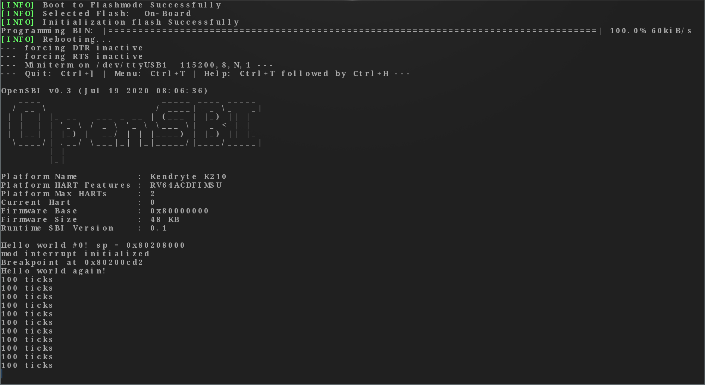

# rCore Tutorial Lab
## 简介
本仓库是在 rCore Tutorial v3 实验指导下，动手复现的代码，并且在这基础之上完成了实验题的实现，另外我还根据自己的想法添加了一些东西。  
注意，Lab6 文件夹下的代码是最终代码。因为我做 Lab 的时间比较早，有些实验助教还没来得及改，因此 Lab0~Lab1 中的代码可能和最终的代码有比较大的出入。另外我的实验题都是在 Lab6 中实现的。  
Lab6 是我根据实验指导一步步构建起来的代码，因此请助教学长主要检查这里。麻烦了。  
## 文件说明
+ Lab0～Lab6：各个阶段的代码
+ clean.sh：批量进行` cargo clean `的脚本
+ path：辅助 clean.sh 的文件
+ report.md：实验报告
+ README.md：本文件
## Lab 完成情况
首先动手复现了 Lab0～Lab6 的全部代码。  
其次是完成了除页面置换算法，实现` sys_pipe `之外的全部实验题，具体如下：  
+ 基于线段树的物理页面分配算法：[Segment Tree Allocator](https://github.com/SKTT1Ryze/OS_Tutorial_Summer_of_Code/blob/master/rCore_Labs/Lab6/os/src/algorithm/src/allocator/segment_tree_allocator.rs)
+ 使用伙伴系统实现` VectorAllocator `trait：[Buddy System Allocator](https://github.com/SKTT1Ryze/OS_Tutorial_Summer_of_Code/blob/master/rCore_Labs/Lab6/os/src/algorithm/src/allocator/buddy_system_vector_allocator.rs)
+ 实现操作系统捕获 Ctrl + C 并结束当前运行的线程：[Kill Current Thread](https://github.com/SKTT1Ryze/OS_Tutorial_Summer_of_Code/blob/master/rCore_Labs/Lab6/os/src/interrupt/handle_function.rs)
+ 实现进程的` fork() `：[Fork Current Thread](https://github.com/SKTT1Ryze/OS_Tutorial_Summer_of_Code/blob/master/rCore_Labs/Lab6/os/src/process/thread.rs)
+ 实现` Stride Scheduling `调度算法：[Stride Scheduler](https://github.com/SKTT1Ryze/OS_Tutorial_Summer_of_Code/blob/master/rCore_Labs/Lab6/os/src/algorithm/src/scheduler/stride_scheduler.rs)
+ ` sys_get_id `系统调用：[sys_get_id](https://github.com/SKTT1Ryze/OS_Tutorial_Summer_of_Code/blob/master/rCore_Labs/Lab6/os/src/kernel/process.rs)
+ ` sys_fork `系统调用：[sys_fork](https://github.com/SKTT1Ryze/OS_Tutorial_Summer_of_Code/blob/master/rCore_Labs/Lab6/os/src/kernel/process.rs)
+ ` sys_open `系统调用：[sys_open](https://github.com/SKTT1Ryze/OS_Tutorial_Summer_of_Code/blob/master/rCore_Labs/Lab6/os/src/kernel/fs.rs)

最后在` interrupt `部分添加了中断描述符表` IDT `的实现：[IDT](https://github.com/SKTT1Ryze/OS_Tutorial_Summer_of_Code/blob/master/rCore_Labs/Lab6/os/src/interrupt/idt.rs)  
详细的实现方法请看实验报告：[rCore Lab Report](https://github.com/SKTT1Ryze/OS_Tutorial_Summer_of_Code/blob/master/rCore_Labs/report.md)  
## Lab 之外做的研究
在 k210 板子上跑 rCore-Tutorial。  

